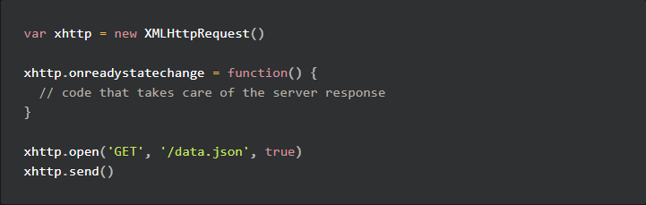

# Chapter 0

## __Introduction__
Full Stack Open is a course designed to be an introduction to modern web development with JavaScript, with the main focus being single page applications.

These applications will be implemented with React and supported by RESTful and GraphQL web services implemented in Node.js. There is also a module that covers Typescript.

### __Taking the course__
The course material is meant to be read section by section, where each section is completed in its entirety before moving on to the next one.

Each part of the course should correspond to one week, or approximately 15-20 hours of studying, but the speed of completion is flexible.

You should be sure to master each part before proceeding to the next part.

### __Grading__
You can't get university credits for this course unless you have a Finnish social security number, but you can get a certificate without one as long as you have submitted the assignments via the github submission service.

Cheating is bad ...mmmkay?

## __Fundamentals of Web apps__
- The example app used in this chapter can be found here:
    - https://fullstack-exampleapp.herokuapp.com/

- The first rule of web development is to __*always*__ keep the developer console open (F12 in Chrome)

### __HTTP GET__
- The server and your web browser communicate with each other using the HTTP protocol, the Network tab of the Chrome developer console shows this in detail.

- __The Network Tab__ of the developer console will tell you the status returned, the size of the req/res, the time everything took, what headers were sent, the response content, and so on

- We received a response with the __Content-Type__ response header of text/html encoded using UTF-8 and our browser should know to render this 'like a web page'

- __The Response Tab__ of the console will show the response data, in this case a regular HTML page that contains a div, a header, a paragraph tag, and an img tag

- Because of the img tag, the browser also performs a second HTTP request to fetch the image *kuva.png*
    - The response headers tell us the response size is 89350 bytes, it's Content-type is image/png, and so the browser will know how to render it to the screen

- A diagram description of the above can be seen below:
> 

### __Traditional web applications__
- The homepage of the example app works like a *traditional web application*
    - Enter the page
    - Browser fetches the document from the server
    - The server forms the document
    - Static pages can be delivered immediately from storage on the server
    - Dynamic pages may need to form the document based on things like the data stored in a database
        - Dynamic pages could be as simple as string formatting some HTML code, though this is a bad practice

- In traditional web applications the browser is "dumb", it just fetches data from the server

- All application logic is on the server, think Java's Spring, or Python's Flask, or Ruby's Rails

- This course will use Express and Node.js to create a web server

### __Running application logic on the browser__
- Moving over to the notes page of the app, refreshing the page yields 4 requests:
    - html document
    - css stylesheet
    - javascript script
    - json xhr

- When we inspect the HTML documennt we can see that the long list of notes we see on the page are not present in the HTML. Instead, the head section of the HTML contains a script tag, which causes the browser to fetch main.js.
    - This example uses xhttp-object instead of the modern fetch as to entirely avoid the subject of promises at this point.

- After fetching the script tag, the browser begins to execute the code which downloads the JSON containing the notes and forms a list from its contents

- It does this by following these steps:
    - Create an unordered list using the ul tag
    - Create an li tag for each note in the file using the content field of each note
    - Print each line to the browser's development console

### __Event handlers and Callback functions__
- We can notice some strangeness in how our requesting code is at the bottom, but our response handling code is on top:
> 

- This is because the function being assigned to "onreadystatechange" is an __event handler__ for the xhttp object doing the requesting
    - When the state of the object changes, the browser calls the event handler function

- Event handlers are called __callback functions__ where the application code doesn't invoke the function itself, but instead relies on the runtime environment (or browser) to call the function at the appropriate time

### __Document Object Model or DOM__
- HTML pages inherently have a hierarchical tree structure to them that the browser uses to decide how to render the page

- __Document Object Model / DOM__ is an API, which enables programmatic modification of the web page element tree

- When we, for instance, loop through our list of notes, we're using the DOM-API to create the "li" elements for our unordered list "ul"

- After we have added all of the notes as "li"s to our "ul", we add the "ul" to the page using the DOM-API as well

### __Manipulating the document object from console__
- The topmost node of our DOM tree is called the "document" object

- We can view this document in the browser console by typing "document" into it

- We can also manipulate the document from the console using standard javascript - it's just key to remember that the changes made to the page from the console are inpermanent and will disappear when we reload the page

### __CSS__
- In example's HTML "head" tag, we specify a CSS file using the "link" tag

- __Cascading Style Sheets (CSS)__: a markup language used to determine the appearance of web pages

- In the example we define two class selectors, they are used to separate how we style different portions of the page

- A class selection starts with the period, followed by the name of the class
    - *Ex:* .class

- We can add our CSS classes to our HTML elements as attributes which will tell them how to be styled

- HTML elements can also have other attributes than classes - __id__ attributes are also used at times

- In the browser the *Elements* tab of the console can be used to change the style of the elements - again this is not permanent and changes will be gone if the page is reloaded

### __Loading a page containing JavaScript-revised__
> 

1. The client performs an HTTP GET request to the server for the "notes" page
2. The HTML page is returned to the client by the server
3. The client then performs an HTTP GET request to the server for the "main.css" file as is specified in the notes page's "link" tag
4. The CSS file is returned to the client by the server
5. The client then performs an HTTP GET request to the server for the "main.js" file as is specified in the notes page's "script" tag
6. The JS script is returned to the client by the server
7. The client begins executing js code that goes about requesting JSON data from the server
8. The client performs an HTTP GET request to the server for the "data.json" file
9. The json content is returned to the client by the server
10. The client executes the event handler and renders the notes to display

### __Forms and HTTP POST__
- To explore how we add a note to the page we need to introduce __forms__ and the __HTTP POST__ method

- The HTML form tag describes what inputs are taken and what should be done with them
    - In the example app we take text and a "submit" as input, represented by the note textbox and the "Save" button, and send them to the "new_note" endpoint of the app via an HTTP POST call

- When we submit a new note via the example app, we can see via the browser's "Network" tab that this results in 5 HTTP requests:
    1. HTTP POST to the "new_note" page as we saw before, which is returned by the server as a 302 (url redirect) status code
    2. As a result of the re-direct, the server asks the browser to do a new HTTP GET request to the address defined in the header's *Location* - the address "notes", which is a document
    3. The rest of the requests should look familiar, we then perform an HTTP GET for the main.css, the main.js, and the data.json in that order.

### __AJAX__
- The "Notes" page of the application follows an early 00's web development convention and "uses Ajax"

- __Asynchronous JavaScript and XML (AJAX)__: an approach to fetching the content of web pages using JavaScript included within HTML without the need to rerender the page. It was introduced in February 2005.

- Prior to AJAX, all web pages worked like a traditional web application - all of the data was fetched by HTML generated by the server

- The example app reflects the old way of doing things as fetching directly from a full url is not in line with the RESTful way of doing things

### __Single page app__
- In our example app, the "Home" page works like a traditional web page - all of the logic is on the server, and the browser only renders the HTML as instructed

- The "Notes" page cedes some responsibility to the browser - namely generating the HTML for the existing notes. The browser does this by fetching the notes JSON from the server and uses the DOM API to add the notes as HTML elements.

- __Single Page Applications (SPA)__: a recently emerging style of creating web apps where pages are comprised of one HTML page that we may edit using JavaScript on the client's browser rather than fetching multiple different pages from the server.

- The "Notes" page of the example app is close to a SPA, but not quite because we're still using a form submit and a redirect

- We could edit this app to be a proper SPA by changing how we define our form tag (no longer using an HTTP POST to new_notes) and also the corresponding JavaScript - by using the "onSubmit" event handler, displaying the default behavior using "e.preventDefault()", creating  new note, and pushing it to the server via an HTTP POST request

### __Javascript-libraries__
- The sample app was written in vanilla JavaScript, using only the DOM-API and JavaScript

- Many libraries can also be added to add additional functionality to the language - one such language we'll use __JQuery__

- JQuery was developed back when HTML was more often traditionally generated, but it was successful at the time because it worked across browsers, though its used less now in favor of vanilla JS

- The rise of the single page app brought several more "modern" ways of web development than JQuery. BackboneJS was popular for a while, then AngularJS, and now React + Redux will be used in this course

Who knows what's next? Will Vue rise in popularity? Who knows?

### __Full stack web development__
- Practically all web apps have at least two "layers" 
    - The browser is the top layer
    - The server is the bottom layer
    - Sometimes there are other layers, like maybe a database layer below the server

- We can think of the *architecture* of a web app as a stack of layers

- In the context of this course, full stack web development means we focus on all parts of the app: frontend, backend, database - all of which will be in JavaScript

### __Javascript fatigue__
- Full stack web development is challenging: debbugging is harder, things are happening everywhere at once, JavaScript doesn't work how you'd expect, web development involves knowledge of HTTP, databases, server admin, configuration, and enough design to make a presentable product...

- __Javascript Fatigue__: Is the term that has come to describe the frustration and exhaustion the rapid pace of change web development brings upon many of its engineers

- By trying to focus on code over configuration, we can avoid many of the common sources of javascript fatigue