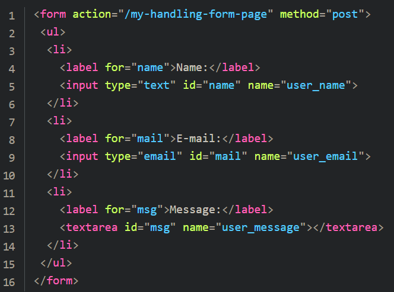
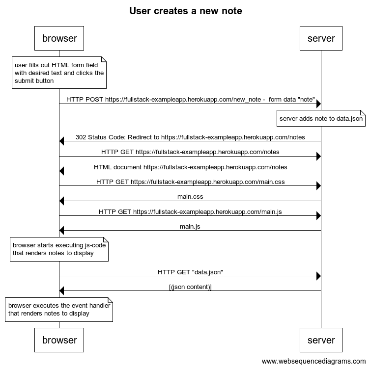
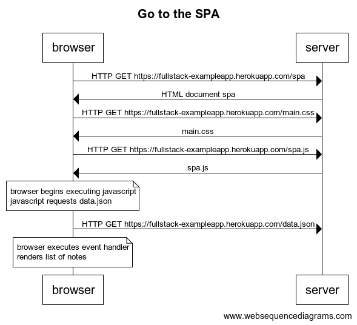
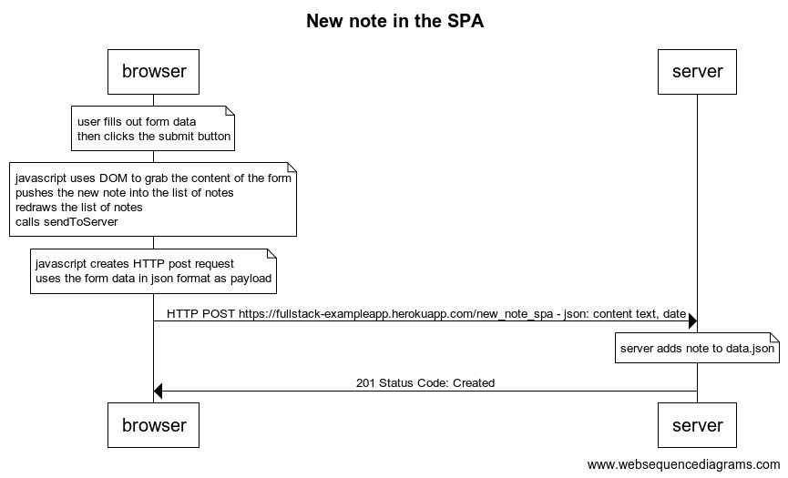

## __Exercises__

### __0.1__
> Review the basics of HTML by reading this tutorial from Mozilla: [HTML tutorial](https://developer.mozilla.org/en-US/docs/Learn/Getting_started_with_the_web/HTML_basics) 

#### Introduction
- HTML is the code used to structure a web page and its content
- HTML is a *markup language*, meaning it defines the structure of your content

#### Anatomy of an HTML element
- HTML consists of nested elements, which enclose other content to make the overall page appear or behave a certain way like linking to another page, italicization, control font size, and more - those elements may also have attributes as shown below

- 

- 

#### Nesting elements
- You can put elements inside of other elements as well - this is called "nesting"
    - __DO__: `
My cat is <strong>very</strong> grumpy.
`
    - __DONT__: `
My cat is <strong>very grumpy.
</strong>`

#### Empty elements
- Some elements, like __img__, have no content and are called __empty elements__

- This is because they are not wrapping content, their purpose is to embed an image in a web page

#### Anatomy of an HTML document
- __!DOCTYPE html__: The doctype. It is required. Back in the day this was used to make sure that  the right documents followed the right set of rules, but it doesn't serve much purpose today.
- __html /html__: this element wraps all of the content for the entire page and is sometimes known as the root element.
- __head /head__: Acts as a container for all of the page's metadata - things like keywords, page descriptions, CSS for styling the page, etc.
- __meta charset="utf-8"__: Sets the character set your document should use to UTF-8 which includes most characters from the vast majority of languages - there is no reason *not* to set this and it may help avoid problems
- __title / title__: Sets the title of your page which appears in the tab of the page its loaded in.
- __body /body__: Contains all the content that you want to show to users who visit to see, whether that be text, images, videos, or anything else

#### Images
- We can use the "img" tag to embed an image in the place it appears in the HTML, which has the following attributes:
    - __src__: A reference to the image source
    - __alt__: Contains descriptive text for accessibility or page loading issues

#### Headings
- Heading elements allow you to specify content headings or subheadings
    - "h1" is the largest heading
    - "h6" is the smallest, though probably only up to 3 or 4 should be used

#### Paragraphs
- Paragraphs of text, represented by the "p" tag, are what is used to add text content

#### Lists
- There are two types of HTML lists:
    - __Unordered Lists__: represented by the ul tag
    - __Ordered Lists__: represented by the ol tag

- Both lists use the "li" tag for subelements of the ol or ul tag to denote list items 

#### Links
- Links use the "a" (anchor) tag and an href attribute to reference the external content

- Make sure you don't leave out the "http" or "https"

- href stands for hypertext reference

### __0.2__
> Review the basics of CSS by reading this tutorial from Mozilla: [CSS tutorial](https://developer.mozilla.org/en-US/docs/Learn/Getting_started_with_the_web/CSS_basics)

#### Introduction
- CSS (Cascading Style Sheets) is the code that styles web content

#### What is CSS?
- CSS is neither a programming language nor is it a markup language - CSS is a style sheet language

#### Anatomy of a CSS ruleset
- The entries of our CSS document are called __rulesets__ - the diagram of one is shown below:
- 
    - __Selector__: Defines the element to be styled
    - __Declaration__: A single rule as part of our ruleset - specifys which property to style and how
    - __Properties__: Choose which properties of the HTML element are to be changed
    - __Property value__: The value of the property we're setting

#### Selecting multiple elements
- You can also select multiple elements and apply a single ruleset to all of them by using commas
    - __Ex__: 
    - `p, li, h1 { color: red; }`

#### Different types of selectors
- There are CSS selectors by HTML element (tag/type selector), ID selector, class selector, attribute selector, or pseudo-class selector

- Look here [(link)](https://developer.mozilla.org/en-US/docs/Web/Guide/CSS/Getting_started/Selectors) for a guide on CSS selectors

#### Fonts and text
- Use the following properties for styling text:
    - __font-size__: specifies size of text, either by pixels or one of the other specifications
    - __font-family__: specifies the type of font to use
    - __text-align__: sets the alignment of the text element within its parent container
    - __letter-spacing__: sets the spacing, typically in pixels, between letters in text

#### CSS: all about boxes
- CSS is all about boxes because most HTML elements of the page can be thought of as boxes sitting on top of boxes

- CSS layout is based on the box model where each element has the following attributes:
    - __padding__: the space around the content
    - __border__: the solid line that is just outside the padding
    - __margin__: the space around the outside of the border

- Other elements that get used often are:
    - __width__: obv.
    - __background-color__: the color behind the content and padding
    - __color__: thhe color of an element's content - typically text
    - __text-shadow__: sets a drop shadow on the text inside an element
    - __display__: sets the display mode of an element

#### Changing the page color
- We can set the background color of the page by setting the "background-color" property of the html selector to the corresponding hexadecimal value

#### Styling the body
- The body is styled in much the same way that everything else is - NEXT!

#### Positioning and styling the main page title
- We can override tthe browser's default HTML styling for certain elements (like headers) by setting attributes like margin and padding

#### Centering the image
- Instead of using a trick of messing with the img's margin to center the image, we can do something better
    - Image are, by default, inline elements - meaning that they aren't effected by margin or spacing values
    - If we want our image to be treated as a block element we can set it to use block-level behavior by setting the "display" property to be "block"

### __0.3__
> Learn about the basics of HTML forms by reading Mozilla's tutorial [Your first form](https://developer.mozilla.org/en-US/docs/Learn/Forms/Your_first_form)

#### What are web forms?
- Web forms allow uers to input data, which is then sent to a server for processing and storage, or used on the client-side to immediately update the interface

- A web form's HTML is made up of __form controls__ (sometimes called widgets), and are referred to as HTML forms

- Form controls can also be programmed to enforce specific formats or values to be entered (form validation) and also have accessibility attributes as well

#### Designing your form
- Before coding it is useful to take a step back and write up a quick mock-up - from a UX perspective, the more form data you ask people to fill out, the more likely you are to lose users

- Read about more UX topics on your own time, it's a rich and active topic of discussion in web design communities

#### The form element
- All HTML forms start with a "form" element which acts as a container for the form child elements

- Most often forms will define the "action" and "method" attributes:
    - __action__: defines the location where the form's collected data should be sent
    - __method__: defines which HTTP method to send the data with (usually a GET or a POST)

#### The label, input, and textarea elements
> 

- Things to note about the screenshot above:
    - There is an input with the label Name that takes "text" as input
    - There is an input with the label Email that takes an input of type "email"
    - There is a textarea with the label "Message" that will act as an open text box
    - The "for" attribute is what is attaching each label to its corresponding element id which is good for UX and accessibility 

#### The button element
- Finally we should add a button to our form to allow the user to submit it

- We can accomplish this simply using a "button" tag of the type "submit"

- Clicking a "submit" button sends the form's data to the web page defined by the "action" on the form element

- Clicking a "reset" button resets all the form widgets to their default value immediately - this is considered a bad practice though

- Clicking a "button" button does... nothing. But you can make it do something by adding javascript to it.

#### Basic form styling
- Use CSS like we talked about in the other section

#### Sending form data to your web server
- The last part is to handle the form data on the server side

- We already saw how the HTML form in the example is structured above - we're accepting 3 inputs: a name, an email, and a message

- In the example this data will be sent via an HTTP POST under the corresponding names: user_name, user_email, and user_message

- On the server side the script at the URL "my-handling-form-page" will receive the data as a list of 3 key/value items contained in the request

- Your script is up to you, could be Java, PHP, Python, C#, Ruby, whatever you want

### __0.4__
> In chapter Loading a page containing JavaScript - revised the chain of events caused by opening the page https://fullstack-exampleapp.herokuapp.com/notes is depicted as a sequence diagram

> The diagram was made using websequencediagrams service as follows:

- > browser->server: HTTP GET https://fullstack-exampleapp.herokuapp.com/notes
- > server-->browser: HTML-code
- > browser->server: HTTP GET https://fullstack-exampleapp.herokuapp.com/main.css
- > server-->browser: main.css
- > browser->server: HTTP GET https://fullstack-exampleapp.herokuapp.com/main.js
- > server-->browser: main.js

- > note over browser:
    - > browser starts executing js-code
    - > that requests JSON data from server 
    - > end note

- > browser->server: HTTP GET https://fullstack-exampleapp.herokuapp.com/data.json
- > server-->browser: [{ content: "HTML is easy", date: "2019-05-23" }, ...]

- > note over browser:
    - > browser executes the event handler
    - > that renders notes to display
    - > end note

> Create a similar diagram depicting the situation where the user creates a new note on page https://fullstack-exampleapp.herokuapp.com/notes by writing something into the text field and clicking the submit button.

> If necessary, show operations on the browser or on the server as comments on the diagram.

> The diagram does not have to be a sequence diagram. Any sensible way of presenting the events is fine.

> All necessary information for doing this, and the next two exercises, can be found from the text of this part. The idea of these exercises is to read the text through once more, and to think through what is going on where. Reading the application code is not necessary, but it is of course possible.

- > 

### __0.5__
> Create a diagram depicting the situation where the user goes to the single page app version of the notes app at https://fullstack-exampleapp.herokuapp.com/spa.

- > 

### __0.6__
> Create a diagram depicting the situation where user creates a new note using the single page version of the app.

- > 