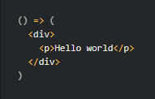
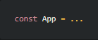
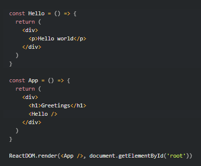
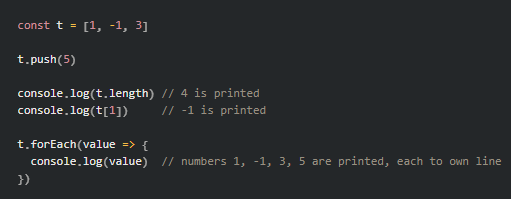
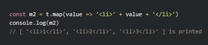
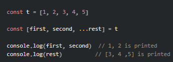
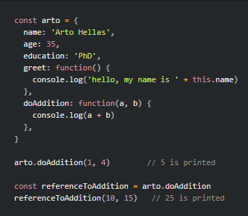
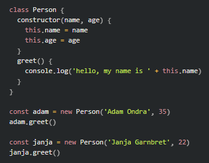

# Chapter 1

## __Introduction to React__
- The easiest way to get a React app out of the box is by using the __create-react-app__ tool

- You can start your react app with:
    - npm start
    - By default it should start on port 3000

- For the purpose of this chapter, we'll remove most of the auto-generated content from this app and begin with a basic "Hello World"

### Component
- After the "Hello World" changes, our *index.js* file now defines a React __component__ with the name "App"

- The command "ReactDOM.render(App /, document.getElementById('root')) renders it into a div element with the Id of 'root'

- By default the generated *index.html* file is blank. However, generally in a React app all content that needs to be rendered is defined as React components

- Our "Hello World" component is first defined as a function that takes no inputs:
- 
- We then assign it to the constant variable that we'll end up referencing in our component file:
- 

- There are a couple of ways to define functions in JavaScript:
    - The way we're using in this example uses __arrow functions__, which are just syntactically simpler function definitions without bindings to this, arguments, or super
    - __Regular functions__ are just used to define a function within an expression without the above limitations

- Important to note that because this function only consists of a single expression we can omit the "return" statement

- We can add more dynamic content in the form of JavaScript code - this code will be executed and placed in the HTML when the function is evaluated

### JSX
- It may seem like our React components are returning HTML markup - but the layout of React components is actually written in JSX, which an HTML-like syntax that compiles to JavaScript

- The compiling of our application is handled by Babel, a popular JavaScript compiler

- If you're a nerd you can write pure JS without JSX

- JSX is just HTML that can embed dynamic content, or any other templating language

- Every tag in JSX must be closed

### Multiple components
- Now we're going to modify the application to add a Hello component to our index.js file and embed it within our App component as follows:
    - 

- We can see that writing and embedding React components is easy - this allows us to keep large applications quite maintainable
    - This is a key concept of React

- Another concept in React is the concept of a *root component* called *App* at the top of the component tree of the application
    - This isn't a hard rule, but a useful note for the time being

### props: passing data to components
- __props__: Are the preferred method of passing data to components

- We can edit our "Hello" component to accept a "name" prop so that we can properly greet our users

- We can also edit it to accept an "age" prop so that we can tell the user how old they are

- These inputs can either be hardcoded or be represented by more JavaScript

### Some notes
- Even though React has pretty good error messages, it is a good idea to advance slowly early on to ensure that the changes being made are functional

- __THE CONSOLE SHOULD ALWAYS BE OPEN!!!__

- You can print using console.log()

- React component names must be capitalized!

## __Javascript__
- The official name of the JavaScript standard is ECMAScript with ECMAScript 2019, or ES10, being the most recent release

- Unfortunately browsers don't yet support all of the features, so code gets *transpiled* to older JS versions - usually by Babel

- Node.js is a JavaScript runtime environment based on chrome's V8 JS engine and can run on anything more or less

- JavaScript has some similarities to Java (beyond just the name), but ultimately they are different should be treated as such

### Variables
- There are a few different ways to define variables in JavaScript:
    - __const__: immutable
    - __let__: mutable
    - __var__: legacy, outdated

### Arrays
- An __array__ and some examples:
- 

- Contents of __const__ arrays can be modified, it will still point to the same object in memory

- __forEach__ is one way to iterate through an array - it receives a *function* defined using the arrow syntax as a param

- New items can be added to an array using the __push__ method

- React employs many techniques from functional programming, such as immutable data structures, etc.
    - In React we will usually use the __concat__ method instead of __push__, which will create a new array with the item added instead of altering the old one

- There is also the __map__ method, which will create a new array from a provided function
    - This function could be as simple as something that adds 2 to every item of the array, or it could transform each element into something else entirely
    - 

- We can access individual array items with the help of __destructuring assignment__, like shown:
    - 

### Objects
- One way of defining objects in JavaScript is by using __object literals__:
    - __Example__:
    ```js
    const object = {
        name: 'Arto Hellas',
        age: 35,
        education: 'PhD',
    }
    ```

- The value of the properties can be of any type and the properties of an object are references by using the "dot" notation, or by using brackets:
    
    ```js
     console.log(object.name)
    ```
    
    ```js
    console.log(object['name'])
    ```

- Properties can also be added using the same notation
    - if using special characters like a space, you must use the brackets notation

-  Objects can also be defined using constructor functions, which is similar to other languages such as Java


### Functions
- We have already written and discussed arrow functions to some extent:
    
    ```js
    const sum = (p1, p2) => {
        console.log(p1)
        console.log(p2)
        return p1 + p2
    }
    ```
- And we call the method and get the expected output (not shown, because it's pretty clear...)

- There are some exceptions to the formatting above:
    - If we only take in one argument, we can exclude the parantheses at the beginning
    - If we only have a single expression we can remove the curly braces and reduce our function down to a single line
        - This is especially useful for for map functions:

        ```js
        const t = [1, 2, 3]
        const tSqrd = t.map(p => p * p)
        ```

- Prior to ES6 the only way to declare a function was to use the ```function``` keyword:

    ```js
    function product(a, b) {
        return a * b
    }
    ```

- The other way to define the function is using a __function expression__ - in this case there is no need to give the function a name:

    ```js
    const average = function(a, b) {
        return (a + b) / 2
    }
    ```
- In this course we will define all functions using the arrow syntax

### Object methods and "this"
- Because we'll be using a version of React with the "hooks" feature, we have no need for defining objects with methods
    - Ergo this is "nice to know" but not necessary

- Arrow Functions and Regular Functions behave very differently when used with respect to "this", the object keyword

- You can assign methods to an object by defining properties that are functions:
    - 

- Some things to note:
    - Methods can be assigned to objects even after the creation of the object
    - We can store a *method reference* to an existing function in our object and subsequently call it using method syntax
    - __this__ in JavaScript is defined based on how the method is called
        - when using a method reference, this becomes a global and doesn't have access to object internals anymore

- We will avoid most of the problems arising from the scoping of "this" by just avoiding it entirely
    - The __bind__ method allows us to write JavaScript closer to what we might expect
    - For more information [visit this egghead.io article](https://egghead.io/courses/understand-javascript-s-this-keyword-in-depth)

### Classes
- JavaScript does not have a class mechanism like the ones found in OOP languages - but they have some concepts that come close

- One such example of JavaScript "classes" can be seen below:
    - 

- As you can see, the syntax is similar to that of Java classes, but under the hood any class instances we create will always follow JavaScript's __prototypal inheritance__ where every type is either a Boolean, null, Undefined, Number, String, Symbol, or Object

- Classes were a controversial JavaScript addition - but for most of the course we will use React __hooks__ rather than classes

### Javascript materials
- There are a lot of JavaScript resources out there on the web, some good, many not as good - this course references Mozilla's JavaScript guide

- One especiall good resource is Mozilla's "Re-introduction to JavaScript" tutorial:
    - [Link to the document](https://developer.mozilla.org/en-US/docs/Web/JavaScript/A_re-introduction_to_JavaScript)

- Other resources:
    - [You don't know JS](https://github.com/getify/You-Dont-Know-JS)
    - [javascript.info](https://javascript.info/)
    - [egghead.io (some paywalled)](https://egghead.io/)

## __Component, state, event handlers__
- We're moving on to a new example:

    ```js
    const Hello = (props) => {
      return (
        <div>
          <p>
            Hello {props.name}, you are {props.age} years old
          </p>
        </div>
      )
    }
    
    const App = () => {
      const name = 'Peter'
      const age = 10
    
      return (
        <div>
          <h1>Greetings</h1>
          <Hello name="Maya" age={26 + 10} />
          <Hello name={name} age={age} />
        </div>
      )
    }
    ```

### Component helper functions
- We can expand our Hello component to guess the year of birth of the person being greeted

    ```js
    const bornYear = () => {
        const yearNow = new Date().getFullYear()
        return yearNow - props.age
    }
    ```

- The logic for guessing the year of birth is separated into its own function that is called when the component is rendered

- Unlike other languages, defining functions inside of other functions is common in JavaScript

### Destructing
- In ES6 __destructuring__ was added to the language, allowing objects and array values to be de-structured upon assignment

- In the last example we had our object, ```props```, that we can to reference the members of by doing things like, ```props.age```, multiple times.
    - Instead, we can destructure props' members into variables in a few different ways:

        ```js 
        const name = props.name
        const age = props.age
        ```
        or, slightly better:

        ```js
        const Hello = (props) => {
            const {name, age} = props
            ...
        ```
        or, even better:
        ```js
        const Hello = ({name, age}) => {
            ...
        ```

### Page re-rendering
- So far our applications have been static after their initial rendering, but what if we wanted to create a more dynamic page?

- We start with the following example code:
    
    ```js
    const App = (props) => {
        const {counter} = props
        return (
            <div>{counter}</div>
        )
    }

    let counter = 1

    ReactDOM.render(
        <App counter={counter} />, 
        document.getElementById('root')
    )
    ```
- We can make the following observations:
    - The ```App``` component is given the value of the counter via the ```counter``` prop
    - Even if we were to add the line, ```counter += 1``` to the above code, we won't see the counter increment
    - If we want the counter to increment, we need to call ```ReactDOM.render()``` again

- One simple way of re-rendering our component would be to call ```ReactDOM.render()``` directly, say, in a refresh method:

    ```js
    const refresh = () => {
        ReactDOM.render(<App counter={counter} />,
        document.getElementById('root'))
    }

    refresh()
    counter += 1
    refresh()
    ...
    ```

- We could also use ```setInterval()``` to schedule regular refreshing of our page, but considering that calling rerender all the time is a bad practice, let's look at the alternative...

### Stateful component
- Up to this point all of our components have been simple in the sense that they do not contain any state that could change during the lifecycle of the component - they are *static*

- The __state hook__ allows us to add a state to our applications App component - allowing us to change our application to the following:

    ```js
    // 1. we import useState from react
    import React, { useState } from 'react'
    import ReactDOM from 'react-dom'

    const App = () => {
        // 2. we add state to the counter component and initialize it at 0
        // we destructure the result of that function into counter and setCounter
        const [counter, setCounter ] = useState(0)

        // 3. we call setTimeout function so that we call setCounter() one second after setTimeout is called 
        setTimeout(
            () => setCounter(counter + 1),
            1000
        )

        // 4. we return the altered component
        return (
            <div>{counter}</div>
        )

        // 5. the change in state means react will re-render the changed component, thus again calling the code in the component's body, thus again changing the component... so it goes...
    }

    ReactDOM.render(
        <App />,
        document.getElementById('root')
    )
    ```
- Calling the state modifying function will prompt React to re-render the component, meaning that the function body of the component gets re-executed  

### Event handling
- We mentioned __event handlers__ in part 0 - these are functions that are registered to be called when specific events occur

- Let's change our application so that increasing the counter happens when a user clicks a button
    - Buttons support mouse events - of which, "onClick" is the most common event

    ```js
    const App = () => {
        const [ counter, setCounter ] = useState(0)

        // here is our event handler
        const handleClick = () => {
            setCounter(counter + 1)
        }

        // when we define our button, we tell its onClick event to call handleClick()
        return (
          <div>
            <div>{counter}</div>
            <button onClick={handleClick}>
              plus
            </button>
          </div>
        )
    }
    ```

- We could also replace ```handleClick``` with ```() => setCounter(counter + 1)``` and eliminate that function entirely

- We also add a reset button and now our return looks like this:

    ```js
    return (
        <div>
        <div>{counter}</div>
        <button onClick={() => setCounter(counter + 1)}>
            plus
        </button>
        <button onClick={() => setCounter(0)}> 
            zero
        </button>
        </div>
    )
    ```

### Event handler is a function
- As I saw when I tried to simplify "onClick" to only be ```setCounter(...)```, doing such a thing causes an error to be thrown upon rendering the web page
    - __"Error: Too many re-renders. React limits the number of renders..."__

- What is happening here is that event handler is actually a *function call*, which is ok sometimes, but not in the case of our recursive function
    - As we see, we instead use ```() => setCounter(...)``` to make it so that we only execute setCounter() once per button press
    - Normally, defining event handlers inside of our JSX is a bad idea, but because this one is pretty simple it is ok

- Even though they are simple, we separate them out to separate functions for good practice:

    ```js
    const increaseByOne = () => setCounter(counter + 1)
    const setToZero = () => setCounter(0)

    <button onClick={increaseByOne}>
    <button onClick={setToZero}>
    ```

### Passing state to child components
- Again, React emphasizes that you should aim to write components that are small and reusable across the application and even across projects - so we're going to break up our application further so that we have:
    - A component for displaying the counter
    - Two components for the button

- First up, the *Display* component - the one responsible for displaying the counter
    - A best practice here is to "lift the state up" in the component hierarchy:
        > [Often, several components need to reflect the same changing data. We recommend lifting the shared state up to their closest common ancestor.](https://reactjs.org/docs/lifting-state-up.html)
    - This basically means if we want the internal values of multiple components to be kept in sync (which we often do), we move ownership of the state up in our component hierarchy... pretty simple

- In our project we will accomplish this by placing the state in the *App* component and passing it down to *Display* through *props*:
    
    ```js
    const Display = (props) => {
        return (
            <div>{props.counter}</div>
        )
    }
    ```
    - We then just replace the existing ```<div>{counter}</div>``` with ```<Display counter={counter} />``` to complete the switch

- Now we move on to our *Button* component - for this we will need to pass the event handler as well as the button's text through the props:

    ```js
    const Button = (props) => {
        return (
            <button onClick={props.handleClick}>
                {props.text}
            </button>
        )
    }
    ```
    - We also add this button to our example project by replacing all of the existing JSX ```<button>...</button>``` sections with our new React components

- One last thing to note, "handleClick" was not not a random name choice, it is suggested by React's own official tutorial - so use that when you want to write a click handler

### Changes in state cause rerendering
- Let's review a bit:
    - When the application starts, the code in ```App``` is executed
    - We are using a __useState__ hook to create the application state, and setting the initial value of ```counter```
    - The ```Counter``` component contains the ```Display``` component - which displays the initial value of 0, and the three ```Button``` components - all of which have event handlers for changing the state of the counter
    - When one of the buttons is clicked, it triggers an "event"
    - This causes the event handler to change the state of ```App``` and the component is re-rendering with the state change
    - This also causes the sub-components, ```Display``` and ```Button``` to be re-rendered as well
    - ```Display``` receives the new value for the counter
    - ```Button``` again receives the eventHandlers to change the state again

### Refactoring the components
- Let's use destructuring to change our *Display* component from this:

    ```js
    const Display = (props) => {
      return (
        <div>{props.counter}</div>
      )
    }
    ```
    to this

    ```js
    const Display = ({counter}) => <div>{counter}</div>
    ```

- We can also use destructuring to simplify our *Button* component to the following:

    ```js
    const Button = ({ handleClick, text }) => (
      <button onClick={handleClick}>
        {text}
      </button>
    )
    ```

## __A more complex state, debugging React apps__

### Complex state
- In the last part our application's state was pretty simple - just a single integer - but what if it was more complex than that?
    - In most cases we would just use the ```useState```function multiple times to create separate "pieces" of state
    - For this part, we begin with the following example code:

        ```js
        const App = (props) => {
            const [clicks, setClicks] = useState({
            left: 0, right: 0
            })

            const handleLeftClick = () => {
            const newClicks = { 
                left: clicks.left + 1, 
                right: clicks.right 
            }
            setClicks(newClicks)
            }

            const handleRightClick = () => {
            const newClicks = { 
                left: clicks.left, 
                right: clicks.right + 1 
            }
            setClicks(newClicks)
            }

            return (
            <div>
                <div>
                {clicks.left}
                <button onClick={handleLeftClick}>left</button>
                <button onClick={handleRightClick}>right</button>
                {clicks.right}
                </div>
            </div>
            )
        }       
        ```

- Because we have two separate functions for controlling the two pieces of state, we could combine them into a single object:
    ```js
    {
        left: 0,
        right: 0
    }
    ```

- Now we can make our ```useState``` call look like this:
    ```js
    const [clicks, setClicks] = useState({
        left: 0, right: 0
    })
    ```

- We can also use __object spread__ syntax to clean up the "handle" functions, like so:
    ```js
    const handleLeftClick = () => setClicks({ ...clicks, left: clicks.left + 1 })
    ...
    ```
    - The ```...clicks``` syntax indicates that we're creating a copy of all values of the clicks object that we don't specify otherwise, which is cleaner than assigning everything else to itself

- You might ask, why don't we just update the state directly, like so:
    ```js
    const handleLeftClick = () => {
        clicks.left++
        setClicks(clicks)
    }
    ```
    - This is because __mutating state directly is forbidden in React!!!__ It could have unexpected side effects, so in React we always create a copy and edit that.

- However, storing all of our state in a single object is a bad choice for this application as there is no benefit to doing so and the resultant code is a lot more complex
    - We will see that storing a piece of application state in a more complex data structure may offer more benefits than what we did during this section

### Handling arrays
- Let's add a piece of state to our application containing an array, `allClicks` that remembers all the clicks in the application

```js
const App = () => {
  const [left, setLeft] = useState(0)
  const [right, setRight] = useState(0)
  const [allClicks, setAll] = useState([])

  const handleLeftClick = () => {
    setAll(allClicks.concat('L'))
    setLeft(left + 1)
  }

  const handleRightClick = () => {
    setAll(allClicks.concat('R'))
    setRight(right + 1)
  }

  return (
    <div>
      {left}
      <button onClick={handleLeftClick}>left</button>
      <button onClick={handleRightClick}>right</button>
      {right}
      <p>{allClicks.join(' ')}</p>
    </div>
  )
}
```

- It is also possible to add items to our array using the ```push``` method, but we should not do this - __because we should not mutate our React components directly__
    - ```concat``` returns a new copy of the array with the item added to it, it does not mutate the original object

- Lastly we call the ```join``` method to join our array into a single string, separated by the argument we passed in: a space (' ')


### Conditional rendering

### Old React

### Debugging React applications

### Rules of Hooks

### Event Handling Revisited

### Function that returns a function

### Passing Event Handlers to Child Components

### Do Not Define Components Within Components

### Useful Reading