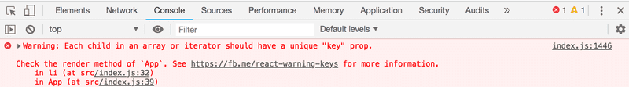
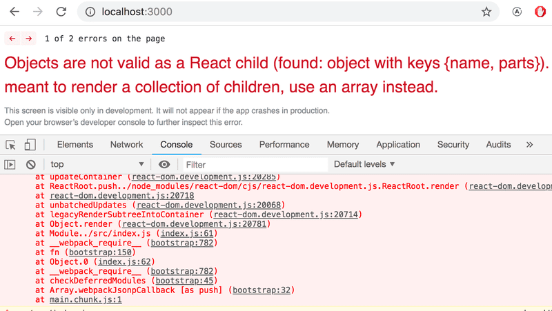
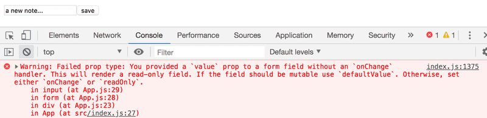
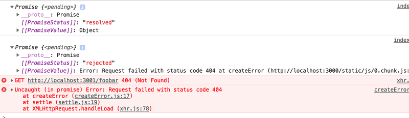
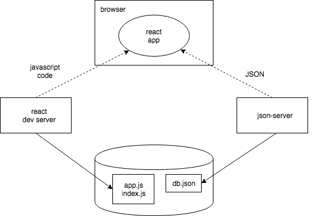
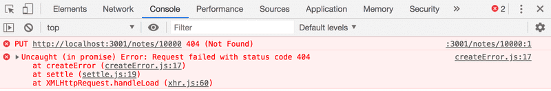

# Chapter 2

## Rendering a collection, modules
- Some recap before diving into new territory

### console.log
- Experience JS developers use the log... a lot
- Don't concatenate things like `console.log('the value of props is' + props)` with a `+`, separate using a `,` like `console.log('the value of props is', props)` unless you like seeing `[Object object]` a lot

### Protip: Visual Studio Code snippets
- With VS Code you can create and use 'snippets', i.e. shortcuts for commonly used code portions
- Documentation on these snippets can be found below:
    - [About snippets](https://code.visualstudio.com/docs/editor/userdefinedsnippets#_creating-your-own-snippets)
    - [React Snippet Plug-in](https://marketplace.visualstudio.com/items?itemName=xabikos.ReactSnippets)

### Javascript Arrays
- From now until the end of the course we'll be using the functional programming methods of JS arrays, e.g. `find`, `filter`, and `map` - so get used to it
- Links for help on functional programming in JS:
    - [Functional programming in JS](https://www.youtube.com/playlist?list=PL0zVEGEvSaeEd9hlmCXrk5yUyqUag-n84)
    - [Higher-order functions](https://www.youtube.com/watch?v=BMUiFMZr7vk&list=PL0zVEGEvSaeEd9hlmCXrk5yUyqUag-n84)
    - [Map](https://www.youtube.com/watch?v=bCqtb-Z5YGQ&list=PL0zVEGEvSaeEd9hlmCXrk5yUyqUag-n84&index=2)
    - [Reduce basics](https://www.youtube.com/watch?v=Wl98eZpkp-c&t=31s)

### Event handlers revisited
 - Event handlers gave several people in the course some trouble, so if you're one of those people, look at:
    - [Event handlers revisited](https://fullstackopen.com/en/part1/a_more_complex_state_debugging_react_apps#event-handling-revisited)
    - [Revision on the topic](https://fullstackopen.com/en/part1/a_more_complex_state_debugging_react_apps#passing-event-handlers-to-child-components)  

## Review of concepts over... on to Chapter 2  

### Rendering collections
- We will now focus on the front-end with the following example:

```js
import React from 'react'
import ReactDOM from 'react-dom'

const notes = [
  {
    id: 1,
    content: 'HTML is easy',
    date: '2019-05-30T17:30:31.098Z',
    important: true
  },
  {
    id: 2,
    content: 'Browser can execute only JavaScript',
    date: '2019-05-30T18:39:34.091Z',
    important: false
  },
  {
    id: 3,
    content: 'GET and POST are the most important methods of HTTP protocol',
    date: '2019-05-30T19:20:14.298Z',
    important: true
  }
]

const App = (props) => {
  const { notes } = props

  return (
    <div>
      <h1>Notes</h1>
      <ul>
        <li>{notes[0].content}</li>
        <li>{notes[1].content}</li>
        <li>{notes[2].content}</li>
      </ul>
    </div>
  )
}

ReactDOM.render(
  <App notes={notes} />,
  document.getElementById('root')
)
```
- Each note contains its textual content, a timestamp, a unique id, and a boolean value indicating its importance

- Of course it is not practical to hardcode an index for each note we'd like to render

- Instead, we can generate React elements from the array using the **map** function

    ```js
    notes.map(note => <li>{note.content}</li>)
    ```

- We can then use this function within `<ul></ul>` tags and format appriately to get the following:

    ```js
    const App = (props) => {
        const { notes } = props

        return (
            <div>
                <h1>Notes</h1>
                <ul>
                    {notes.map(note => 
                    <li>
                        {note.content}
                    </li>
                    )}
                </ul>
            </div>
        )
    }
    ```

### Key-attribute
- The code from the above section will appear to work, but a message like the following appears in the browser console:
    

- As the [link](https://reactjs.org/docs/lists-and-keys.html#keys) in the message shows, the list items must each have a unique key value

- So let's add the keys:
    ```js
    const App = (props) => {
        const { notes } = props

        return (
            <div>
                <h1>Notes</h1>
                <ul>
                    {notes.map(note => 
                    <li key={note.id}>
                        {note.content}
                    </li>
                    )}
                </ul>
            </div>
        )
    }
    ```
- React needs this key attribute to determine how to update the view generated by a component when the component is re-rendered

### Map
- Let's take the array of notes from earlier to look at how the `map` function works:
    ```js
    const notes = [
        {
            id: 1,
            content: 'HTML is easy',
            date: '2019-05-30T17:30:31.098Z',
            important: true
        },
        {
            id: 2,
            content: 'Browser can execute only JavaScript',
            date: '2019-05-30T18:39:34.091Z',
            important: false
        },
        {
            id: 3,
            content: 'GET and POST are the most important methods of HTTP protocol',
            date: '2019-05-30T19:20:14.298Z',
            important: true
        }
    ]
    ```

- Say we add the following code:
    ```js
    const result = notes.map(note => note.id)
    console.log(result)
    ```
    - *[1, 2, 3]* will then be printed to the console
        - `map` creates a new array from the elements of the original array by *mapping* using the function given as paramater to the *map* method
        - The function is `note => note.id` AKA `(note) => {return note.id}`
        - The function gets a note object as a paramater and returns the value of its id field

- If we change the command to:
    ```js
    const result = notes.map(note => note.content)
    ```
    - We will get an array containing the content of the notes
    - This is pretty close to the React code we used in the previous section

- Just remember that when you need React to render something, it must be in curly braces `{}`
    ```js
    note => <li key={note.id}>{note.content}</li>
    ```
    - We need `{}` on `note.id` and `note.content` so that the actual value of the variables appears in our `<li></li>`

### Anti-pattern: array indexes as keys
- We could have made the key attribute error message from earlier disappear by using the array indexes as keys by passing a second paramater to the callback function of the map method:
    
    ```js
    notes.map((note, i) => ...)
    ```

- When called like this `i` is assigned the value of the index of the position in the array where the note resides - so you could do something like:

    ```js
    <ul>
        {notes.map((note, i) => 
            <li key={i}>
                {note.content}
            </li>
        )}
    </ul>
    ```

- **DO NOT DO THIS** - it can cause undesired problems even if it seems to work just fine.
    - [Read more](https://medium.com/@robinpokorny/index-as-a-key-is-an-anti-pattern-e0349aece318)

### Refactoring modules
- We can tidy the code up a bit by destructuring to grab just the `notes` field of the props and refactoring the note into its own component:

    ```js
    const Note = ({ note }) => {
        return (
            <li>{note.content}</li>
        )
    }

    const App = ({ notes }) => {
        return (
            <div>
                <h1>Notes</h1>
                <ul>
                    {notes.map(note => 
                        <Note key={note.id} note={note} />
                    )}
                </ul>
            </div>
        )
    }
    ```
- Note that the *key* attribute must now be defined for the `Note` component and not for the `<li></li>` tags like before

- Unlike we've been practicing so far, React applications are typically note written in a single file. Usually each component gets its own file as an *ES6-module*
    - Like we've seen when we write
        ```js
        import React from 'react'
        import ReactDOM from 'react-dom'
        ```
    - The above imports the modules `react` and `react-dom` and indicates they should be referenced by "React" and "ReactDOM", respectively

- In most relatively small applications components are placed in `./src/components` with the file being named after the component

- After refactoring into a module, our `Note` component looks like this:

    ```js
    import React from 'react'

    const Note = ({ note }) => {
        return (
            <li>{note.content}</li>
        )
    }

    export default Note
    ```
- Most notably here is the last line, in order to use our component elsewhere, we must first export it using `export default Note`
    - Then we can import the `Note` module in *index.js* by writing `import Note from './components/Note'`

- We repeat this process with our `App` component, placing it directly in the `~/src/` directory because it is the root of our application so that now *index.js* looks like this:
    ```js
    import React from 'react'
    import ReactDOM from 'react-dom'
    import App from './App'

    const notes = [
    // ...
    ]

    ReactDOM.render(
        <App notes={notes} />,
        document.getElementById('root')
    )
    ```

### When the application breaks
- Sometimes you're coding along, minding your own business when, seemingly out of nowhere, everything breaks down - especially in a dynamically typed language such as JS. It might look like this:

    

- In these situations the best way out is `console.log` - the piece of code causing that message is this:

    ```js
    const Course = ({ course }) => (
        <div>
            <Header course={course} />
        </div>
    )

    const App = () => {
        const course = {
            // ...
        }

        return (
            <div>
            <Course course={course} />
            </div>
        )
    }
    ```
- We can hone in on the root issue by adding `console.log` commands to the code
    - We'll begin by adding one to the `App` component as it is the first thing to be rendered
    - We may also need to refactor some compactly-written components to allow for better logging:
        ```js
        const Course = ({ course }) => (
            <div>
                <Header course={course} />
            </div>
        )
        ```
        - becomes
        ```js
        const Course = ({ course }) => { 
            console.log(course)
            return (
                <div>
                    <Header course={course} />
                </div>
            )
        }
        ```

- Oftentimes the problem is that the props are expected to be of a different type or called with a different name than they actually are and destructuring fails - this may require us to remove destructuring and see what the `props` actually contain
    ```js
    const Course = (props) => {
        console.log(props)
        const { course } = props
        // ...
    ```

- If the problem *still* hasn't been resolved, more `console.log` statements and bug-hunting are required

## Forms
- We'd now like to add the ability to add new notes to our application - to do this we will define a piece of state in our `App` component that is initialized with the notes array passed from the props
    - Note that we're initializing our state with an array with the `useState` function

    ```js
    import React, { useState } from 'react'
    import Note from './components/Note'

    const App = (props) => {
        const [notes, setNotes] = useState(props.notes)

        return (
            <div>
                <h1>Notes</h1>
                <ul>
                    {notes.map(note => 
                        <Note key={note.id} note={note} />
                    )}
                </ul>
            </div>
        )
    }

    export default App
    ```
- Next, let's add an HTML form to the component that will be used for adding notes
    ```js
    const App = (props) => {
        const [notes, setNotes] = useState(props.notes)

        const addNote = (event) => {
            event.preventDefault()
            console.log('button clicked', event.target)
        }

        return (
            <div>
                <h1>Notes</h1>
                <ul>
                    {notes.map(note => 
                        <Note key={note.id} note={note} />
                    )}
                </ul>
                <form onSubmit={addNote}>
                    <input />
                    <button type="submit">save</button>
                </form>   
            </div>
        )
    }
    ```
- We have added the `addNote` function as an event handler to the form element that will be called when the form is submitted by clicking the submit button
    - The `event` parameter is the event that triggers the call to the event handler
    - The event handler calls `event.preventDefault()` to avoid the default action of form submission which would include a page reload

- To begin accessing the data in the form's input element, we add a new piece of state called `newNote` for storing input **and** we set it as the input element's *value* attribute
```js
const App = (props) => {
  const [notes, setNotes] = useState(props.notes)
  const [newNote, setNewNote] = useState(
    'a new note...'
  ) 

  const addNote = (event) => {
    event.preventDefault()
    console.log('button clicked', event.target)
  }

  return (
    <div>
      <h1>Notes</h1>
      <ul>
        {notes.map(note => 
          <Note key={note.id} note={note} />
        )}
      </ul>
      <form onSubmit={addNote}>
        <input value={newNote} />
        <button type="submit">save</button>
      </form>   
    </div>
  )
}
```
- However, this causes a console error as *'a new note...'* appears in the input element, but the input text can't be edited:

    

- In order to enable editing of the input element, we need another event handler to sync changes between `<input>` and the component's state
```js
const handleNoteChange = (event) => {
    console.log(event.target.value)
    setNewNote(event.target.value)
}
```
- and add it to the input element
```html
<form onSubmit={addNote}>
    <input
        value={newNote}
        onChange={handleNoteChange}
    />
    <button type="submit">save</button>
</form>
```
- The event handler is called every time *a change occurs in the input element*
    - The event object is received as the `event` parameter
    - The `target` property refers to the *input* element
    - `event.target.value` then refers to the input value of the element
    - We did not call `event.preventDefault()` because there is no default action on input change

- After these changes, the `newNote` state reflects the current value of the input, which means we can complete the `addNote` function for creating new notes:
    ```js
    const addNote = (event) => {
        event.preventDefault()
        const noteObject = {
            content: newNote,
            date: new Date().toISOString(),
            important: Math.random() < 0.5,
            id: notes.length + 1,
        }

        setNotes(notes.concat(noteObject))
        setNewNote('')
    }
    ```
    - The note content comes from the `newNote` state, which now reflects the `<input>` element on the page
    - The id comes from incrementing the length of the list of notes
        - This only works because we can't delete notes
    - By using `Math.random()` our note has a 50-50 shot of being marked as important
    - The note is added to the list using `concat`
        - Do not mutate state directly in React!!!!!!!
    - Lastly, we reset the value of the controlled input element by calling `setNewNote` of the `newNote` state

- Code for the above is [here](https://github.com/fullstack-hy2020/part2-notes/tree/part2-2)    

### Filtering displayed elements
- Now we want to add a filter to the app that only shows important notes - we can begin this by adding a piece of state to the `App` that keeps track of which notes should be displayed
    ```js
    const App = (props) => {
        const [notes, setNotes] = useState(props.notes) 
        const [newNote, setNewNote] = useState('')
        const [showAll, setShowAll] = useState(true)
        // ...
    ```

- We'll also change the component so it stores a list of all the notes to be displayed in the `notesToShow` variable where the items of this list depend on the state of the component:
    ```js
    const notesToShow = showAll
        ? notes
        : notes.filter(note => note.important === true)
    ```
    - and correspondingly we change the  `<ul>` tags of our return to only display those notes captured in our `notesToShow` function:
    ```js
    <div>
        <h1>Notes</h1>
        <ul>
            {notesToShow.map(note =>
                <Note key={note.id} note={note} />
            )}
        </ul>
        // ...
    </div>
    ```
    - This functions works by using the JS conditional operator
        - `const result = condition ? valIfTrue : valIfFalse`
    - In our case, if `showAll` is false - then we'll only show the notes marked as important, if `showAll` is true - then we'll show the whole notes list
    - We accomplish filtering by use of the `filter` method:
        - `array.filter(item => item.property === valueToFilterOn)`

- Lastly, let's add the ability to toggle the `showAll` state of the application from the user interface:
    ```js
    // ...
    return (
        // ...
        <h1>Notes</h1>
        <div>
            <button onClick={() => setShowAll(!showAll)}>
                show {showAll ? 'important' : 'all' }
            </button>
        </div>
        <ul>
            {notesToShow.map(note =>
                <Note key={note.id} note={note} />
            )}
        </ul>
        // ...
    )
    ```
    - The displayed notes are now controlled with a button whose event handler, `() => setShowAll(!showAll)`, is so simple that we define it directly in the attribute of the button element
        - The text of the button also depends on the value of the `showAll` state

## Getting data from the server
- To begin looking at the back-end of applications we will use [JSON Server](https://github.com/typicode/json-server) to act as a server by creating a file resembling the following called *db.json*:
```json
{
  "notes": [
    {
      "id": 1,
      "content": "HTML is easy",
      "date": "2019-05-30T17:30:31.098Z",
      "important": true
    },
    {
      "id": 2,
      "content": "Browser can execute only JavaScript",
      "date": "2019-05-30T18:39:34.091Z",
      "important": false
    },
    {
      "id": 3,
      "content": "GET and POST are the most important methods of HTTP protocol",
      "date": "2019-05-30T19:20:14.298Z",
      "important": true
    }
  ]
}
```
- You can install JSON Server globally:
    - `npm install -g json-server`
- Or locally to a project (within the project dir.):
    - `npx json-server --port 3001 --watch db.json`
    - By default this would use port 3000, but because our React app is already using that port we specify 3001

### The browser as a runtime environment
- Before we worry about adding new notes to the server, we will fetch the notes already specified in *json.db*

- In the part 0 example project we used **XMLHttpRequest** to make an HTTP request using an XHR object - an approach that is no longer recommended

```js
const xhttp = new XMLHttpRequest()

xhttp.onreadystatechange = function() {
  if (this.readyState == 4 && this.status == 200) {
    const data = JSON.parse(this.responseText)
    // handle the response that is saved in variable data
  }
}

xhttp.open('GET', '/data.json', true)
xhttp.send()
```
1. We register an *event handler* to the `xhttp` object
2. This event handler will be called whenever the state of the `xhttp` object changes
3. If the state change means the response to the request has arrived, the data is parsed
- It should also be noticed that the event handler is defined before the the request is sent to the server but will still execute later on - the code therefore executes *asynchronously*

- Asynchronous programming is required by almost all JavaScript engines / runtimes for IO operations - meaning that they are non-blocking, code will continue to execute after an IO call, even if it is not complete
    - After the IO operation's completion, the JS engine calls the event handler registered to the operation
    - This requirement is in place because most JS engines / runtimes are single-threaded - blocking calls would cause the browser to "freeze"
    - Similar behavior can be seen by long-running code, the following code will also cause the browser to "freeze" after 5 seconds:
    ```js
    setTimeout(() => {
        console.log('loop..')
        let i = 0
        while (i < 50000000000) {
            i++
        }
        console.log('end')
    }, 5000)
    ```
    - For the browser to remain responsive, the code logic needs to be such that no single computation can take too long
    - [What the heck is the event loop anyway?](https://www.youtube.com/watch?v=8aGhZQkoFbQ)
    - It is possible to parallelize code with ["web workers"](https://developer.mozilla.org/en-US/docs/Web/API/Web_Workers_API/Using_web_workers) but the event loop of the browser window is still single-threaded

### npm
- We could use `fetch` to pull data from the server - it's promise based and and is supported by all modern browsers - but we're going to use `axios` because it's pretty much the same thing but gives an opportunity to talk about adding *npm packages* to our React project

- npm is the "node package manager" and it uses the *package.json* file located in the project

- We could add `axios` by defining the library directly in *package.json*, but it's better to install it from the command line using:
    - `npm install axios`
    - **Reminder:** npm commands should always be run in the project root directory, which is where package.json can be found
    - After running the command in the root directory, axios will be added to the package.json file and downloaded the library code and placed it in the *node_modules* directory

- We can install `json-server` in a similar way by using the command `npm install json-server --save-dev` and start it using the command `npm run server`
    - We add the `--save-dev` option to `json-server` and not `axios` because `json-server` is only a devleopment dependency, whereas `axios` is a runtime dependency required by our program in order to execute

### Axios and promises
- Now we should be ready to use axios and we can access the library by using an appropriate `import` statement:
```js
import axios from 'axios'

const promise = axios.get('http://localhost:3001/notes')
console.log(promise)

const promise2 = axios.get('http://localhost:3001/foobar')
console.log(promise2)
```
- The above code will generate an error message in the console:

    

- This is because Axios' `get` method returns a **promise**
    - Mozilla: *"A Promise is an object representing the eventual completion or failure of an asynchronous operation"*
    - AKA an object that represents an asynchronous operation

- A promise can have three states:

1. **pending**: The final value is not available yet
2. **fulfilled**: The operation has completed and the final value is available, which is usually a successful operation - AKA a resolved state
3. **rejected**: An error prevented the final value from being determined, which is usually a failed operation

- When we want to access the result of the operation represented by the promise, we must register an event handler to it using `then`:
    ```js
    const promise = axios.get('http://localhost:3001/notes')

    promise.then(response => {
        console.log(response)
    })
    ```
    - This will finally print the notes from *json.db* to the console
    - The JS runtime environment calls `then` and provides a `response` object as a parameter containing all essential data related to the HTTP GET request (data, status code, headers)

- Generally it isn't necessary to store the promise in its own variable and often looks better to chain calls together:
```js
axios
  .get('http://localhost:3001/notes')
  .then(response => {
    const notes = response.data
    console.log(notes)
  })
```

- Though the data is returned in plaintext, axios can still parse the data into a JS array because the server has specified that the data format is *application/json; charset=utf-8* in its *content-type* header

- We can now begin using the data from the server and render it in our React app - though the initial approach we will use has many problems as we're only rendering the entire `App` component only when there's a successful response:

```js
import React from 'react'
import ReactDOM from 'react-dom'
import App from './App'

import axios from 'axios'

axios.get('http://localhost:3001/notes').then(response => {
  const notes = response.data
  ReactDOM.render(
    <App notes={notes} />,
    document.getElementById('root')
  )
})
```

### Effect-hooks
- After seeing state hooks earlier, which provide state to components defined as functions, we will now also look at *effect hooks*
    - React docs: *"The Effect hook lets you perform side effects in function components. Data fetching, setting up a subscription, and manually changing the DOM in React components are all examples of side effects"*

- We can now use these effect hooks to fetch data from the server:

```js
import React, { useState, useEffect } from 'react'
import axios from 'axios'
import Note from './components/Note'

const App = () => {
  const [notes, setNotes] = useState([])
  const [newNote, setNewNote] = useState('')
  const [showAll, setShowAll] = useState(true)

  useEffect(() => {
    console.log('effect')
    axios
      .get('http://localhost:3001/notes')
      .then(response => {
        console.log('promise fulfilled')
        setNotes(response.data)
      })
  }, [])
  console.log('render', notes.length, 'notes')

  // ...
}
```

- Our print statements are executed as follows:
    - `render 0 notes`
    - `effect`
    - `promise fulfilled`
    - `render 3 notes`

- First the body of the component is executed and the component is rendered for the first time with 0 notes because data has not yet been fetched from the server

- This effect is executed immediately after rendering - thus printing `effect` to the console:

```js
() => {
  console.log('effect')
  axios
    .get('http://localhost:3001/notes')
    .then(response => {
      console.log('promise fulfilled')
      setNotes(response.data)
    })
}
```

- `axios.get` is called and data starts being fetched from the server and an event handler is registered:

```js
response => {
  console.log('promise fulfilled')
  setNotes(response.data)
})
```
 - When the data arrives from the server, the event handler is called and `promise fulfilled` is printed to the console before storing the received data into the state with `setNotes(response.data)`

 - The call to our state-update function triggers a re-render of the component and now `render 3 notes` is printed to the console and the notes are rendered

 - We can re-write this code differently:
 ```js
 const hook = () => {
  console.log('effect')
  axios
    .get('http://localhost:3001/notes')
    .then(response => {
      console.log('promise fulfilled')
      setNotes(response.data)
    })
}

useEffect(hook, [])
 ```

 - `useEffect` actually takes two parameters - the first a function or the effect itself
    - React docs: *"By default, effects run after every completed render, but you can choose to fire it only when certain values have changed"*

- The second parameter of `useEffect` is used to specify how often the effect is run - if the second param is an empty array, then the effect is only run along with the first render of our component
    - This is useful in our application where we only want to get notes from the server on our initial render

### The development runtime environment
- Let's review how our application works at a high-level to see what happens when and where:

    

1. The JS code making up our React app is run in the browser
2. The browser gets the JS from the *React dev server* - which is the application running `npm start`
3. The dev-server transforms the JS into a format understood by the browser, partially by stitching all of our JS into a single file
4. The React app running in the browser fetches the JSON data from *json-server* running on port 3001 on the machine
5. *json-server* gets its data from the file *json.db*

- This picture begins to change when the application isn't localized to the developer's machine and is deployed to the internet as we'll see in Ch 3

## Altering data in the server
- We want to be able to store notes that we create into some backend server - we will accomplish this by using a REST API

### REST
- In REST terminology we refer to individual data object, like our notes, as *resources*
    - Each resource has a unique address associated with it - its URL
    - Per the convention used by json-server we would be able locate an individual note at the resource URL *notes/3* will return the note that has the id number 3
    - An HTTP GET request to the notes URL would return a list of all notes

- Creating a new resource for storing a note is done by making an HTTP POST request to the notes URL per json-server convention

- json-server requires all data to be sent in JSON format AKA the data must be formatted correctly and contain the *Content-Type* request header with the value *application/json*

### Sending data to the server
- Let's make the following changes to the event handler responsible for creating a new note:

```js
addNote = event => {
  event.preventDefault()
  const noteObject = {
    content: newNote,
    date: new Date(),
    important: Math.random() > 0.5,
  }

  axios
    .post('http://localhost:3001/notes', noteObject)
    .then(response => {
      setNotes(notes.concat(response.data))
      setNewNote('')
    })
}
```
    - We omit the `id` property since its better to let the server generate ids for our resources
    - We send the object to the server with the axios `post` method and the event handler logs the response
    - We may also find it useful to inspect that the headers and data values are correct using the *Network* tab of the Chrome dev tools
    - Remember that `concat` creates a new list!
    - Finally the note appears on the screen because the state-updating function is called

- Now that the data returned by the server is having an effect on the behavior of our application, we have to deal with challenges related to asynchonicity of communication
    - To combat this, we need new debugging strategies, more console logging, and more
    - We also need to understand the Javascript runtime and React components
    - Inspecting the backend server also helps - though later we will learn better methods of checking the back-end

### Changing the importance of notes
- Now we will add a button to every note that can be used for toggling its importance by making the following changes to the `Note` component:
```js
const Note = ({ note, toggleImportance }) => {
  const label = note.important
    ? 'make not important' : 'make important'

  return (
    <li>
      {note.content} 
      <button onClick={toggleImportance}>{label}</button>
    </li>
  )
}
```
   - We add a button to the component and assign the `toggleImportance` event handler to it

- The `App` component defines an initial version of the `toggleImportanceOf` event handler function and passes it to every `Note`:

```js
const App = () => {
  const [notes, setNotes] = useState([]) 
  const [newNote, setNewNote] = useState('')
  const [showAll, setShowAll] = useState(true)

  // ...

  const toggleImportanceOf = (id) => {
    console.log('importance of ' + id + ' needs to be toggled')
  }

  // ...

  return (
    <div>
      <h1>Notes</h1>
      <div>
        <button onClick={() => setShowAll(!showAll)}>
          show {showAll ? 'important' : 'all' }
        </button>
      </div>      
      <ul>
        {notesToShow.map((note, i) => 
          <Note
            key={i}
            note={note} 
            toggleImportance={() => toggleImportanceOf(note.id)}
          />
        )}
      </ul>
      // ...
    </div>
  )
}
```
- Note how every note event handler is specific to the `id`:
    - ```js
        console.log(`the importance of ${id} needs to be toggled`)
      ```

- When we actually want to change the importance of a note, we can do so either with an HTML PUT request to replace the note or an HTML PATCH request to change some of its properties:
```js
const toggleImportanceOf = id => {
  const url = `http://localhost:3001/notes/${id}`
  const note = notes.find(n => n.id === id)
  const changedNote = { ...note, important: !note.important }

  axios.put(url, changedNote).then(response => {
    setNotes(notes.map(note => note.id !== id ? note : response.data))
  })
}
```
- Almost every line of this event handler contains important details:
1. The first line defines the unique url for each note resource based on its `id`
2. The `find` method is used to find the note we want to modify, and we then assign it to the `note` variable
3. We create a new note thats a copy of the old note with a different importance
    - Remember here we are using the [object spread syntax](https://developer.mozilla.org/en-US/docs/Web/JavaScript/Reference/Operators/Spread_syntax)
    - We do this because we **do not want to mutate state directly** in React!
    - `changedNote` is a *shallow copy*, meaning that the values of the new object are the same as the values of the old object - including objects themselves
4. The new note is send with a PUT request to the backend and replace the old object
5. The promise callback then sets the component's `notes` state to a new array that contains all the items from the previous `notes` along with the new/"updated" note

### Extracting communication with the backend into a separate module
- The `App` component has gotten a little bloated with all of our recent changes - single-responsibility principle would suggest that we should move this functionality to its own module

- In a new *src/services* directory, we add a file called *notes.js*:
```js
import axios from 'axios'
const baseUrl = 'http://localhost:3001/notes'

const getAll = () => {
  return axios.get(baseUrl)
}

const create = newObject => {
  return axios.post(baseUrl, newObject)
}

const update = (id, newObject) => {
  return axios.put(`${baseUrl}/${id}`, newObject)
}

export default { 
  getAll: getAll, 
  create: create, 
  update: update 
}
```
- This module returns an object that has three functions that return promises from the axios methods:
    - getAll
    - create
    - update

- The `App` component uses `import` to get access to the module:
```js
import noteService from './services/notes'

const App = () => {
```
- And the funcs can be used directly with the imported variable `noteService`: 

```js
const App = () => {
  // ...

  useEffect(() => {
    noteService
      .getAll()
      .then(response => {
        setNotes(response.data)
      })
  }, [])

  const toggleImportanceOf = id => {
    const note = notes.find(n => n.id === id)
    const changedNote = { ...note, important: !note.important }

    noteService
      .update(id, changedNote)
      .then(response => {
        setNotes(notes.map(note => note.id !== id ? note : response.data))
      })
  }

  const addNote = (event) => {
    event.preventDefault()
    const noteObject = {
      content: newNote,
      date: new Date().toISOString(),
      important: Math.random() > 0.5
    }

    noteService
      .create(noteObject)
      .then(response => {
        setNotes(notes.concat(response.data))
        setNewNote('')
      })
  }

  // ...
}

export default App
```

- We can then go a step further by altering our service to specifically return the response data instead of the entire HTTP response, further simplifying our code - for example:

```js
// src/services/notes.js
const getAll = () => {
  const request = axios.get(baseUrl)
  return request.then(response => response.data)
}

// App
useEffect(() => {
    noteService
      .getAll()
      .then(initialNotes => {
        setNotes(initialNotes)
      })
  }, [])
```
- A reminder that the modified `getAll` function still returns a promise, as the `then` method of a promise also returns a promise

### Cleaner syntax for defining object literals
- The module we formatted in the last part exports the following object:
```js
{ 
  getAll: getAll, 
  create: create, 
  update: update 
}
```
- The left side of this definition are the *keys* of our object, the right side are the *variables* that are defined inside the module - but because these are the same, we can simplify the syntax:
```js
{ 
  getAll, 
  create, 
  update 
}
```
- As a result we can simplify the `export` statement:
    - `export default { getAll, create, update }`

- This is a new feature introduced in ES6 JS to simplify object definitions:
```js
// old way
const person = {
  name: name,
  age: age
}

// new way
const person = { name, age }
```

### Promises and errors
- If our application allowed users to delete notes we could end up in a situation where a user tried to change the importance of note that's already been deleted

- We might receive an error message like this following:

    

- Our application can handle this gracefully by using a second callback function on our promise to be called in the event the promise enters a *rejected* state - the catch method:

```js
axios
  .get('http://example.com/probably_will_fail')
  .then(response => {
    console.log('success!')
  })
  .catch(error => {
    console.log('fail')
  })
```

- The catch method will be used if the request fails and we add it to our existing promise chain:

```js
const toggleImportanceOf = id => {
  const note = notes.find(n => n.id === id)
  const changedNote = { ...note, important: !note.important }

  noteService
    .update(id, changedNote).then(returnedNote => {
      setNotes(notes.map(note => note.id !== id ? note : returnedNote))
    })
    .catch(error => {
      alert(
        `the note '${note.content}' was already deleted from server`
      )
      setNotes(notes.filter(n => n.id !== id))
    })
}
```
- We display the error message using the alert dialog pop-up rather than expecting the user to look at the Chrome developer's console

- We remove the deleted note from the array using the `filter` method, which we are using to return a new array with all the notes except the one that was deleted

- Later on we probably don't want to use `alert`, we'll use something a little more professional-looking

## Adding styles to React app

### Improved error message

### Inline styles
