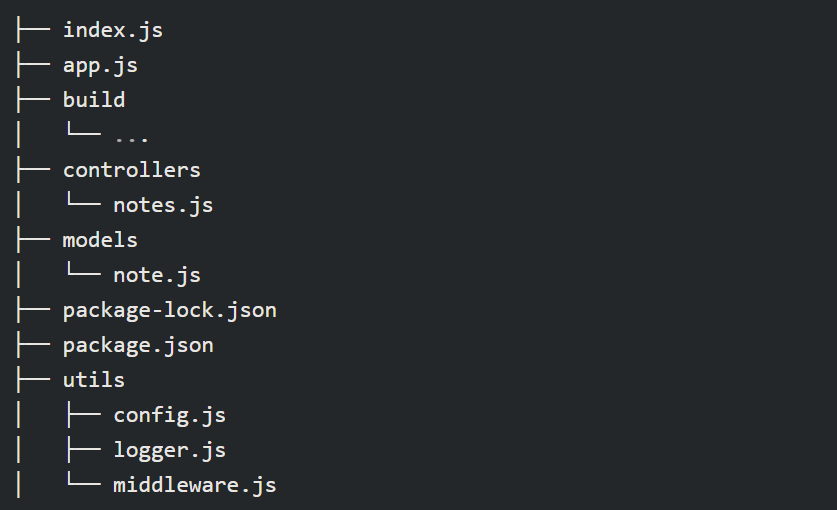
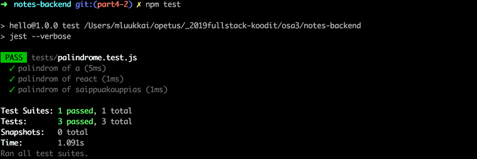
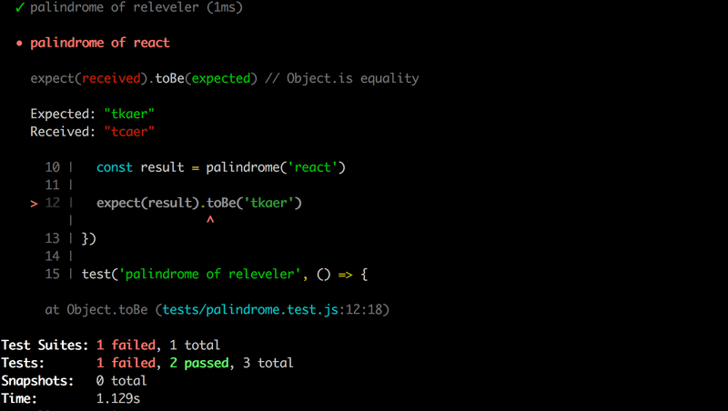
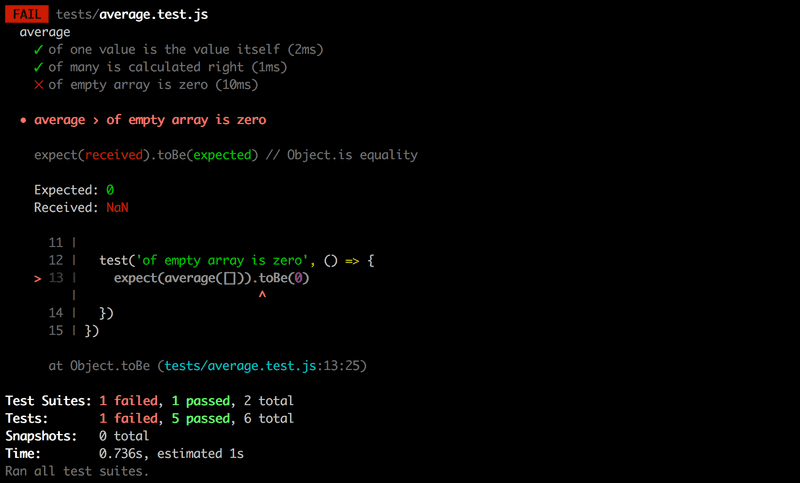
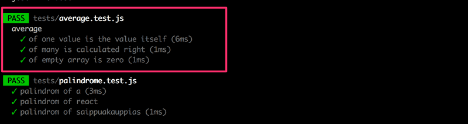

# Chapter 4

## Testing Express servers, user administration
- In this part we continue our work on the backend

- We start by looking at writing unit and integration tests for the backend

- Then we look at implementing user authentication and authorization

## Structure of backend application, introduction to testing

### Project structure
- Before discussing testing, we will modify the structure of our project to follow Node.js best practices

- We should end up with the following structure:

    

- So far we have used `console.log` and `console.error` for printing everything - but we should separate console printing to its own module *utils/logger.js*
```js
const info = (...params) => {
  console.log(...params)
}

const error = (...params) => {
  console.error(...params)
}

module.exports = {
  info, error
}
```

- This module now has a function for *info* level logs and *error* level logs and consolidates log functionality if we want to make changes to how we log messages

- The handling of environment variables is also extracted into a separate *utils/config.js* file
```js
require('dotenv').config()

const PORT = process.env.PORT
const MONGODB_URI = process.env.MONGODB_URI

module.exports = {
  MONGODB_URI,
  PORT
}
```

- The other parts of the application can access environment variables by importing the config module
    - `const config = require('./utils/config')`
    - `logger.info(`Server running on port ${config.PORT}`)`

- The route handlers have also been moved into a dedicated module
    - Event handlers of routes are usually called *controllers* so we move these into a *controllers* directory
    - All of the routes related to notes are now in the *notes.js* module under the *controllers* directory
        - This file is almost an exact copy-paste of the previous index.js file so I excluded it from these notes

- Notable changes to the precious *index.js* file include:
    - We create/export a new express router object for our controller:
        - `const notesRouter = require('express').Router()`
        - `module.exports = notesRouter`
        - This means the router is available for all consumers of our notes module
    - The paths in the route handlers have shortened:
        - We used to have:
        - `add.delete('/api/notes/:id', (request, response) => {`
        - Now we have:
        - `notesRouter.delete('/:id', (request, response) => {`

- So, what are these router objects? Express says:
    - A router object is an isolated instance of middleware and routes. You can think of it as a "mini-application", capable only of performing middleware and routing functions. Every Express application has a built-in app router.

- The router is *middleware* that can be used for defining related-routes in a single place, typically placed in its own module

- The *app.js* file that creates the actual application takes the router into use as shown:
    - `const notesRouter = require('./controllers/notes')`
    - `app.use('/api/notes', notesRouter)`
    - Now the notes router we defined is used if the URL of the request starts with */api/notes* and that's why the notes controller only defines the relevant parts of the routes

- We also move our custom middleware to a new *utils/middleware.js* module:
```js
const logger = require('./logger')

const requestLogger = (request, response, next) => {
  logger.info('Method:', request.method)
  logger.info('Path:  ', request.path)
  logger.info('Body:  ', request.body)
  logger.info('---')
  next()
}

const unknownEndpoint = (request, response) => {
  response.status(404).send({ error: 'unknown endpoint' })
}

const errorHandler = (error, request, response, next) => {
  logger.error(error.message)

  if (error.name === 'CastError') {
    return response.status(400).send({ error: 'malformatted id' })
  } else if (error.name === 'ValidationError') {
    return response.status(400).json({ error: error.message })
  }

  next(error)
}

module.exports = {
  requestLogger,
  unknownEndpoint,
  errorHandler
}
```
- The responsibility of establishing the connection to the database has been given to the *app.js* module

- The *notes.js* file under the *models* directory only defines the Mongoose schema for notes:
```js
const mongoose = require('mongoose')

const noteSchema = new mongoose.Schema({
  content: {
    type: String,
    required: true,
    minlength: 5
  },
  date: {
    type: Date,
    required: true,
  },
  important: Boolean,
})

noteSchema.set('toJSON', {
  transform: (document, returnedObject) => {
    returnedObject.id = returnedObject._id.toString()
    delete returnedObject._id
    delete returnedObject.__v
  }
})

module.exports = mongoose.model('Note', noteSchema)
```

- For smaller applications the structure doesn't matter so much, but larger applications need a scalable structure to support them using separate modules
    - Unlike RubyOnRails there is no best practices in place for naming Express directories

### Testing Node applications
- Now we turn our attention to automated testing and we begin with the simple **unit test**

- Though our application is almost too simple to unit test, we'll begin by creating a new file *utils/for_testing.js* and write a couple of simple functions that we can use for test writing practice:
```js
const palindrome = (string) => {
  return string
    .split('')
    .reverse()
    .join('')
}

const average = (array) => {
  const reducer = (sum, item) => {
    return sum + item
  }

  return array.reduce(reducer, 0) / array.length
}

module.exports = {
  palindrome,
  average,
}
```

- Though there are many testing libraries or *test runners* out there for JS, but for our purposes we will focus on Facebook's library **jest**, that resembles Mocha, another popular JS testing library
    - Plus jest is good for testing React applications

- Since tests are only executed during development, we will install jest like so:
    - `npm install --save-dev jest`

- Let's also define the *npm script* `test` to execute tests with Jest to report about test execution with the *verbose style*:
    - `"test": "jest --verbose"`

- Jest also requires one to specify that the execution environment is Node by adding the following to *package.json*
    - Alternatively this can also be done by using a configuration file with the default name *jest.config.js*, where we can define the execution environment like:
        - `module.exports = {testEnvironment:node, };`
```js
{
 // add to end of package.json
 "jest": {
   "testEnvironment": "node"
 }
}
```

- Now let's create a separate directory for our tests and create a new file called */tests/palindrome.test.js*:
```js
const palindrome = require('../utils/for_testing').palindrome

test('palindrome of a', () => {
  const result = palindrome('a')

  expect(result).toBe('a')
})

test('palindrome of react', () => {
  const result = palindrome('react')

  expect(result).toBe('tcaer')
})

test('palindrome of releveler', () => {
  const result = palindrome('releveler')

  expect(result).toBe('releveler')
})
```

- The ESLint config file we added to the project compalins about the `test` and `expect` commands in our test file because the configuration doesn't allow *globals*
    - We can fix this by adding *"jest": true* to the env property in the *.eslintrc.js* file
```js
module.exports = {
  "env": {
    "commonjs": true 
    "es6": true,
    "node": true,
    "jest": true,
  },
  "extends": "eslint:recommended",
  "rules": {
    // ...
  },
};
```

- In the first row, the test file imports the function to be tested (function under test) and assigns it to a variable called `palindrome`:
    - `const palindrome = require('../utils/for_testing').palindrome`

- Individual test cases are defined with the `test` function
    - The first parameter of the function is the test description as a string
    - The second parameter of the function is a function, that defines the functionality of the test case
    - In our first test, we begin by executing the code to be tested thus generating a palindrome for the string "react", then we verify the results with the `expect` function
        - `expect` wraps the resulting value into an object that offers a collection of *matcher* functions, that can be used to verify the correctness of a result
        - Because we are comparing two strings, we use the `toBe` matcher

- As expected, all of our tests pass:

    

- Jest expects by default that the names of the test files contain *.test* so we will follow the convention of naming our tests with the extension *.test.js*

- If we break our test by altering one of the strings we see the following error message:

    

- Now we add the following tests for the `average` function:
```js
const average = require('../utils/for_testing').average

describe('average', () => {
  test('of one value is the value itself', () => {
    expect(average([1])).toBe(1)
  })

  test('of many is calculated right', () => {
    expect(average([1, 2, 3, 4, 5, 6])).toBe(3.5)
  })

  test('of empty array is zero', () => {
    expect(average([])).toBe(0)
  })
})
```

- The test shows that the function does not work with an empty array:

    

- Fixing this test is as easy as adding a conditional to our `average` function to return 0 if the length of the array is 0 

- We can also use a `describe` block to group tests into logical collections - this also helps with the format of the test output:

    

- As we will see later, the `describe` block is also necessary when we want to run shared setup/teardown operations for a group of tests

- One last thing to notice is that we wrote tests in a compact way - without assigning output of the function under test to a variable:
```js
test('of empty array is zero', () => {
  expect(average([])).toBe(0)
})
```

## Testing of the backend

### Test environment

### supertest

### Initializing the database before tests

### Running tests one by one

### async/await

### async/await in the backend

### More tests and refactoring the backend

### Error handling and async/await

### Eliminating the try/catch

### Optimizing the beforeEach function

### Refactoring tests

## User administration

### References across collections

### Mongoose schema for users

### Creating users

### Creating a new note

### Populate

## Token authentication

### Limiting creating new notes to logged in users

### Error handling

### End notes